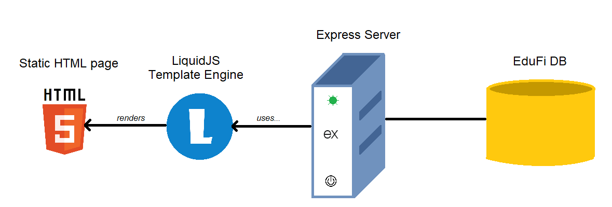
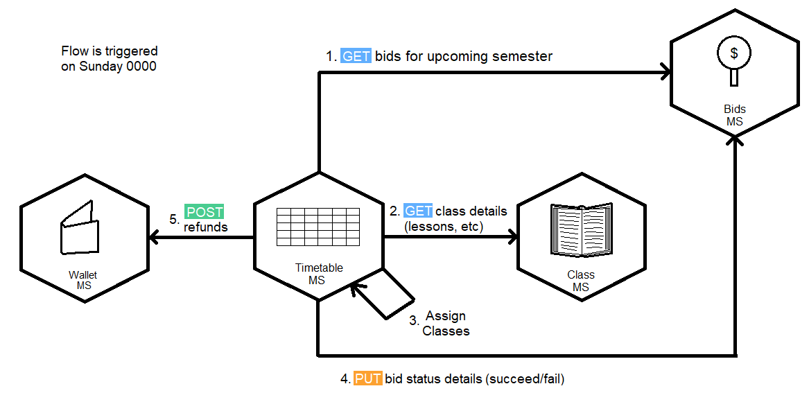

# ETI-EduFi-Timetable
EduFi-Timetable is a microservice that implements part of the 'EduFi' application created for theEmerging Trends in IT module assignment 2. It uses ExpressJS as the backend, with the template engine "LiquidJS". The frontend is a simple html page along with tailwindcss for styling.

## API Specification
This module exposes some endpoints to obtain data from. They are shown below.

| Endpoint                                  | Methods   | Description                                                   |
| ----------------------------------------- | --------- | ------------------------------------------------------------- | 
| /api/v1/allocations/class/:class_id       | GET       | Obtains the allocated students for a particular class ID      |
| /api/v1/allocations/module/:module_code   | GET       | Obtains the allocated students for a particular module code   |
| /api/v1/timetable/student/:student_id     | GET       | Obtains the timetable for particular student                  |
| /api/v1/timetable/tutor/:tutor_id         | GET       | Obtains the timetable for particular tutor                    |

The API Documentation [is also viewable here](https://documenter.getpostman.com/view/19284028/UVXqFYo2)

## Design Considerations
One of the more important parts of the module was to use a scheduler to schedule the allocation of modules. A frontend part was also required. A single microservice was used for this section, as expressJS is capable of serving both the frontend and API on one server. Allocation and award scripts were also hosted and scheduled on the same microservice.

[Ofelia](https://github.com/mcuadros/ofelia) was used as the scheduler instead of the ubiquitous cron, because the docker node image would require installing cron and setting it up manually. Ofelia provided a docker-native method of scheduling, and was easy to set up.

## Architecture Diagram

The architecture diagram is shown below:

## Network Communication
Instances in which inter-microservice communication is required is shown below.

The first instance is the allocation of bids.

## Setting it up

1. Download the config.ini, create_tables.sql, and docker-compose.yml files
2. Run docker-compose up -d
3. Service runs on port 9051

## How does it work?
This section will go through the planned steps in which the microservice accomplshes it's tasks. It's mostly for my own reference.

### 3.15.1 Auto Award 20 ETI tokens for each student at the start of the semester
This task is done using a node script.

1. Obtain full student list from Student API
2. Call Wallet Credit API to credit 20 points to each student. (For loop/Bulk request if available)

This script will be scheduled and run at Sunday 0000 using a cron job

### 3.15.2 Auto Allocate Classes based on highest amount
This task is done using a node script

1. Obtain student bids from Bidding Dashboard API & Class details from class API
2. Check if there are any classess with less than 3 bids. If so, add to refund list.
3. Allocate highest bidders to classes until class capacity has been reached
4. Call Bidding Dashboard API to PATCH the bids with succesful/unsuccessful status
5. Store successful bids in database with: {'Student_ID':123, 'classes':[123,1231,13]} or similar structure
6. Call [3.15.3](#3154-auto-refund-failed-bids) with a list of failed bids as the parameter

### 3.15.3 Generate Timetable
This task shows a timetable for a given tutor/student

#### Student
1. View bid allocations details from database
2. Construct timetable and serve

#### Tutor
1. Get assigned classes for the tutor (need to check+update endpoint required for this)
2. Construct timetable and serve

### 3.15.4 Auto Refund Failed Bid
This task will be called after the completion of [3.15.2](#3152-auto-allocate-classes-based-on-highest-amount)

1. For each bid, get bid amount
2. Call Wallet API to send the amount of points bid to the student's wallet
